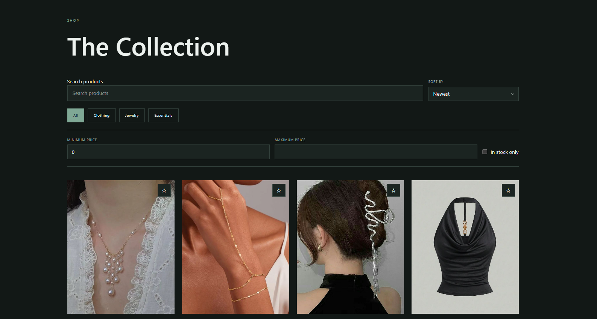
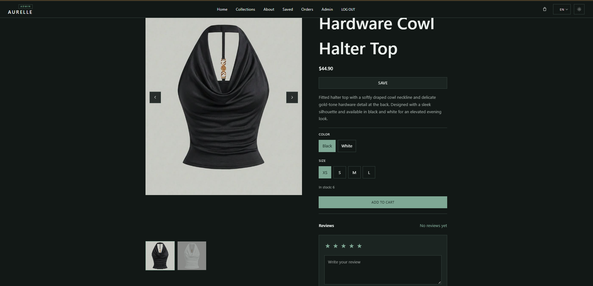
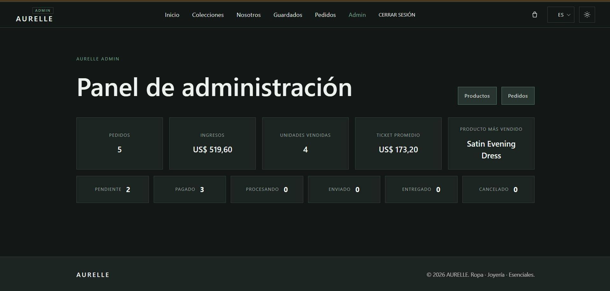

# AURELLE

<p align="center">
  
</p>

<p align="center">
  <strong>Clothing · Jewelry · Essentials</strong>
</p>

<p align="center">
  E-commerce de moda desarrollado con React, TypeScript, Firebase y AWS S3.
</p>

<p align="center">
  <strong>Aplicación publicada:</strong><br>
  <a href="https://aurelle-kappa-two.vercel.app">
    https://aurelle-kappa-two.vercel.app
  </a>
</p>

---

## Descripción

**AURELLE** es una aplicación web de e-commerce desarrollada como Proyecto Integrador 5.

La plataforma permite explorar un catálogo de ropa, joyería y esenciales, consultar variantes disponibles, guardar productos, publicar reseñas, administrar un carrito y realizar pedidos.

También incorpora un panel administrativo desde el que se pueden gestionar productos, stock, pedidos y métricas generales de la tienda.

Además del flujo principal de compra, AURELLE incluye funcionalidades como:

- autenticación mediante email y contraseña;
- inicio de sesión con Google;
- roles de cliente y administrador;
- catálogo de productos;
- búsqueda, filtros y ordenamiento;
- variantes por color y talle;
- control de stock;
- productos guardados;
- reseñas y puntuaciones;
- contador de visualizaciones;
- carrito de compras;
- checkout;
- historial y detalle de pedidos;
- opción de volver a comprar;
- panel administrativo;
- interfaz en español e inglés;
- modo claro y oscuro;
- diseño responsive.

La arquitectura se encuentra organizada principalmente por funcionalidades para mantener separadas las responsabilidades entre componentes, hooks, contextos, servicios, utilidades y tipos.

---

## Tecnologías utilizadas

### Frontend

- React
- TypeScript
- Vite
- React Router
- CSS Modules

### Backend y servicios

- Firebase Authentication
- Cloud Firestore
- Firestore Security Rules
- Amazon S3

### Calidad y testing

- ESLint
- TypeScript
- Vitest
- React Testing Library
- jest-dom
- jsdom
- Vite Build

### Deployment

- Vercel

---

## Autenticación

AURELLE permite:

- registrarse mediante email y contraseña;
- iniciar sesión con email y contraseña;
- iniciar sesión mediante Google;
- cerrar sesión;
- mantener la sesión activa al recargar la aplicación;
- proteger páginas privadas mediante rutas protegidas.

Firebase Authentication administra la identidad de los usuarios.

La información complementaria de cada cuenta se mantiene en Firestore.

---

## Roles

La aplicación diferencia dos roles principales:

```text
customer
admin
```

Los usuarios con rol `customer` pueden utilizar las funcionalidades generales de la tienda.

Los usuarios con rol `admin` cuentan además con acceso al panel administrativo.

El rol del usuario no puede modificarse libremente desde el frontend.

Las rutas administrativas verifican que exista una sesión válida y que el usuario posea los permisos correspondientes.

---

## Catálogo de productos

AURELLE cuenta con un catálogo desde el que pueden consultarse los productos activos.

Las categorías principales son:

- Clothing;
- Jewelry;
- Essentials.

El catálogo permite buscar productos, aplicar filtros y utilizar distintos criterios de ordenamiento.

Desde las tarjetas también puede accederse al detalle del producto o modificar su estado de guardado.



---

## Información de cada producto

Un producto puede contener:

- nombre;
- descripción;
- precio;
- categoría;
- imágenes;
- etiquetas de búsqueda;
- variantes;
- estado activo;
- cantidad de visualizaciones;
- fecha de creación;
- fecha de actualización.

Cada variante puede definir:

- color o diseño;
- talle;
- stock.

Las imágenes de los productos se almacenan en Amazon S3 y Firestore conserva las URLs utilizadas por la aplicación.

---

## Búsqueda, filtros y ordenamiento

La búsqueda contempla información como:

- nombre;
- descripción;
- categoría;
- etiquetas;
- colores disponibles;
- talles disponibles.

También pueden aplicarse filtros por:

- categoría;
- precio mínimo;
- precio máximo;
- disponibilidad de stock.

El precio mínimo permite utilizar el valor `0`.

Los criterios de ordenamiento disponibles incluyen:

- más vistos;
- mejor valorados;
- más nuevos;
- precio de menor a mayor;
- precio de mayor a menor;
- mejor disponibilidad de talles.

El selector de ordenamiento utiliza un componente personalizado en lugar del selector predeterminado del navegador.

Esto permite mantener consistencia visual con otros controles de AURELLE, como el selector de idioma.

---

## Detalle de producto

Cada producto cuenta con una página individual.

Desde ella pueden consultarse:

- imágenes;
- nombre;
- descripción;
- precio;
- categoría;
- variantes;
- colores;
- talles;
- stock;
- estado de guardado;
- puntuación promedio;
- reseñas.

La apertura del detalle también incrementa el contador de visualizaciones utilizado por el criterio de productos más vistos.



---

## Variantes y stock

Los productos pueden contener diferentes combinaciones de:

```text
color + talle + stock
```

Cada variante mantiene su propia cantidad disponible.

El stock se utiliza para determinar qué combinaciones pueden agregarse al carrito.

También vuelve a comprobarse en operaciones donde la información histórica podría haber cambiado, como la recompra de pedidos anteriores.

---

## Productos guardados

Los usuarios autenticados pueden guardar productos para consultarlos posteriormente.

Los favoritos se almacenan en Firestore mediante:

```text
users/{userId}/favorites/{productId}
```

El mismo estado se mantiene sincronizado entre:

- tarjetas del catálogo;
- detalle del producto;
- página de productos guardados.

La funcionalidad utiliza:

```text
FavoritesProvider
FavoritesContext
useFavorites
```

La aplicación mantiene además un `Set<string>` con los IDs favoritos.

Esto permite comprobar rápidamente si un producto está guardado.

AURELLE utiliza una actualización optimista:

```text
Click
  ↓
Actualización local
  ↓
Firestore
  ↓
Éxito → mantener cambio
Error → rollback
```

Si la escritura remota falla, la interfaz vuelve al estado anterior.

---

## Reseñas y puntuaciones

Los usuarios autenticados pueden publicar reseñas sobre los productos.

Cada reseña contiene:

- puntuación de 1 a 5 estrellas;
- comentario;
- usuario;
- fecha de creación;
- fecha de actualización.

Cada usuario puede mantener una única reseña por producto.

El propietario puede:

- crearla;
- editarla;
- eliminarla.

La aplicación calcula además:

- promedio de puntuación;
- cantidad total de reseñas.

Estos datos también se utilizan para ordenar el catálogo por productos mejor valorados.

---

## Carrito

El carrito permite:

- agregar productos;
- agregar una variante específica;
- aumentar cantidades;
- disminuir cantidades;
- eliminar items;
- calcular el total.

Cada item conserva la combinación:

```text
producto + color + talle
```

De esta forma dos variantes diferentes de un mismo producto pueden mantenerse separadas.

La cantidad máxima de cada item respeta el stock disponible de la variante.

---

## Checkout

Desde el carrito el usuario puede continuar al checkout.

La compra utiliza la información correspondiente a los productos y variantes seleccionadas.

El pedido resultante se almacena en Firestore y posteriormente puede consultarse desde la cuenta del usuario.

---

## Pedidos

Los usuarios autenticados cuentan con un historial de pedidos.

Cada pedido permite consultar:

- productos comprados;
- variantes;
- cantidades;
- precios registrados en la compra;
- total;
- estado;
- fecha.

Los estados contemplados son:

```text
pending
paid
processing
shipped
delivered
cancelled
```

---

## Volver a comprar

AURELLE permite volver a agregar al carrito productos pertenecientes a pedidos anteriores.

La recompra no utiliza directamente el precio histórico del pedido.

Antes de agregar cada item se consulta nuevamente el producto actual.

El sistema comprueba:

- que todavía exista;
- que continúe activo;
- que la variante siga disponible;
- que exista stock;
- el precio actual.

El flujo es:

```text
Pedido anterior
      ↓
Producto actual
      ↓
Variante actual
      ↓
Stock actual
      ↓
Precio actual
      ↓
Carrito
```

Si un producto o variante ya no puede comprarse, se omite y se informa al usuario.

De esta manera un pedido anterior nunca obliga a utilizar un precio o stock desactualizado.

---

## Panel administrativo

Los usuarios con rol `admin` cuentan con acceso a un panel de administración.

Desde allí pueden gestionar:

- productos;
- variantes;
- stock;
- pedidos;
- estados;
- métricas generales.

Las rutas administrativas requieren una cuenta autenticada con los permisos correspondientes.



---

## Gestión de productos

El administrador puede:

- crear productos;
- editar productos;
- activar o desactivar productos;
- asignar categoría;
- modificar precio;
- administrar etiquetas;
- administrar imágenes;
- administrar variantes;
- actualizar stock.

Las imágenes se almacenan en Amazon S3.

Firestore conserva las URLs necesarias para utilizarlas desde el frontend.

---

## Gestión de pedidos

Desde el panel administrativo pueden consultarse los pedidos realizados por los usuarios.

El administrador puede modificar el estado de un pedido según su progreso.

Las reglas de Firestore restringen estas operaciones a usuarios con rol administrativo.

---

## Analytics

El panel administrativo incluye métricas relacionadas con la actividad de la tienda.

Estas se construyen a partir de información almacenada en Firestore y permiten visualizar de forma resumida el estado general de AURELLE.

---

## Español e inglés

AURELLE cuenta con soporte para:

```text
ES
EN
```

La aplicación utiliza un sistema propio de internacionalización basado en:

- `LanguageProvider`;
- `useLanguage`;
- claves tipadas con TypeScript;
- archivos separados por idioma;
- módulos divididos por funcionalidad.

Las funcionalidades nuevas mantienen traducciones específicas para dominios como:

```text
discovery
reorder
reviews
```

No fue necesario incorporar una dependencia externa de internacionalización.

---

## Tema claro y oscuro

AURELLE incluye modo claro y modo oscuro.

La interfaz utiliza tokens semánticos reutilizables como:

```text
background
surface
text
accent
muted
border
```

Esto permite mantener consistencia entre componentes y adaptar la interfaz completa al tema seleccionado.

---

## Diseño responsive

La interfaz fue adaptada para funcionar en:

- computadora;
- tablet;
- dispositivos móviles.

La navegación cambia según el espacio disponible.

En pantallas pequeñas se utiliza un menú compacto mientras que en escritorio se muestra la navegación completa.

---

## Arquitectura general

La aplicación está organizada principalmente por funcionalidades.

```text
aurelle/
├── docs/
│   ├── images/
│   │   ├── aurelle-logo.png
│   │   └── app/
│   ├── screenshots/
│   └── ai-usage.md
│
├── src/
│   ├── app/
│   ├── components/
│   ├── config/
│   ├── features/
│   │   ├── admin/
│   │   ├── auth/
│   │   ├── cart/
│   │   ├── favorites/
│   │   ├── language/
│   │   ├── orders/
│   │   ├── products/
│   │   ├── reviews/
│   │   └── theme/
│   ├── hooks/
│   ├── styles/
│   ├── test/
│   └── types/
│
├── firestore.rules
├── vercel.json
├── vite.config.ts
├── vitest.config.ts
├── package.json
└── README.md
```

Dentro de cada funcionalidad se separan responsabilidades mediante carpetas como:

```text
components/
context/
hooks/
pages/
services/
types/
utils/
```

La estructura evita concentrar presentación, estado y acceso a datos dentro de un único archivo.

---

## Firebase Authentication

Firebase Authentication administra la identidad de los usuarios.

AURELLE utiliza:

- email y contraseña;
- Google Sign-In.

La aplicación escucha los cambios de autenticación para conservar la sesión y actualizar las rutas protegidas.

---

## Cloud Firestore

Firestore almacena información relacionada con:

- usuarios;
- productos;
- favoritos;
- reseñas;
- pedidos.

La aplicación combina las restricciones de la interfaz con reglas de seguridad del lado de Firestore.

De esta manera la seguridad no depende únicamente de ocultar controles o proteger rutas visualmente.

---

## Reglas de seguridad de Firestore

El repositorio incluye:

```text
firestore.rules
```

Las reglas contemplan operaciones relacionadas con:

- perfiles;
- roles;
- productos;
- stock;
- favoritos;
- reseñas;
- pedidos.

Los favoritos solamente pueden ser administrados por su propietario.

Las reseñas solamente pueden modificarse o eliminarse por su autor.

Las operaciones administrativas requieren rol `admin`.

---

## Amazon S3

Las imágenes de los productos se almacenan en Amazon S3.

Firestore conserva las URLs necesarias para mostrarlas dentro de la aplicación.

El frontend no contiene credenciales administrativas de AWS.

---

## Variables de entorno

La configuración de Firebase utilizada por el frontend se almacena mediante variables de entorno.

```env
VITE_FIREBASE_API_KEY=
VITE_FIREBASE_AUTH_DOMAIN=
VITE_FIREBASE_PROJECT_ID=
VITE_FIREBASE_STORAGE_BUCKET=
VITE_FIREBASE_MESSAGING_SENDER_ID=
VITE_FIREBASE_APP_ID=
```

El archivo `.env` no debe subirse al proyecto publicado.

Las mismas variables necesarias para producción se encuentran configuradas mediante las Environment Variables de Vercel.

---

## Instalación

Ubicarse dentro de la carpeta del proyecto e instalar las dependencias:

```bash
npm install
```

---

## Ejecución local

Para iniciar la aplicación:

```bash
npm run dev
```

Vite la ejecuta normalmente en:

```text
http://localhost:5173
```

---

## Validación del código

Ejecutar ESLint:

```bash
npm run lint
```

Comprobar TypeScript:

```bash
npx tsc -b --pretty false
```

Generar el build de producción:

```bash
npm run build
```

---

## Testing

AURELLE cuenta con una suite de tests automatizados implementada mediante **Vitest**.

Para los tests relacionados con React también se configuraron:

- React Testing Library;
- jest-dom;
- jsdom.

Actualmente la suite contiene:

```text
7 archivos de test
16 tests automatizados
16 tests aprobados
```

Las pruebas cubren lógica importante de la aplicación, incluyendo:

- búsqueda de productos;
- filtros por categoría, precio y stock;
- ordenamiento por visualizaciones;
- ordenamiento por puntuación;
- ordenamiento por precio;
- ordenamiento por disponibilidad de talles;
- ordenamiento por fecha;
- cálculo del promedio de reseñas;
- incremento y reducción de cantidades del carrito;
- límite de cantidad según stock;
- eliminación de un item al llegar a cero;
- recompra utilizando el precio actual;
- recompra utilizando el stock actual;
- productos inactivos;
- variantes sin disponibilidad;
- errores al recuperar un producto durante la recompra.

Para ejecutar la suite:

```bash
npm run test:run
```

Resultado actual:

```text
Test Files  7 passed (7)
Tests       16 passed (16)
```

---

## Build de producción

Para generar el build:

```bash
npm run build
```

El resultado se genera dentro de:

```text
dist/
```

El build de producción fue verificado correctamente antes del deployment.

---

## Seguridad

Durante el desarrollo se aplicaron distintas medidas para proteger los datos y separar responsabilidades.

### Autenticación

Las páginas privadas requieren una sesión válida.

### Roles

Las rutas administrativas verifican el rol del usuario.

### Firestore

Las reglas restringen las operaciones según el usuario y el recurso.

### Productos guardados

Cada usuario solamente puede administrar sus propios favoritos.

### Reseñas

Cada usuario solamente puede modificar o eliminar sus propias reseñas.

### Pedidos

Los usuarios pueden acceder a sus pedidos mientras que las operaciones administrativas se encuentran restringidas.

### Amazon S3

El frontend utiliza URLs de imágenes y no contiene credenciales privadas de AWS.

### Variables de entorno

La configuración local se mantiene fuera del proyecto publicado mediante `.env`.

---

## Deployment en Vercel

AURELLE se encuentra desplegado en **Vercel**.

La aplicación publicada está disponible en:

```text
https://aurelle-kappa-two.vercel.app
```

Las variables `VITE_FIREBASE_*` necesarias para producción se encuentran configuradas mediante las Environment Variables del proyecto en Vercel.

El deployment utiliza:

```text
Framework: Vite
Build Command: npm run build
Output Directory: dist
```

También se utiliza `vercel.json` para permitir que las rutas manejadas por React Router funcionen correctamente al acceder directamente desde el navegador.

Durante la verificación del deployment se comprobó el funcionamiento de la aplicación en producción.

---

## Documentación del uso de inteligencia artificial

Durante el desarrollo se utilizó inteligencia artificial como herramienta de orientación para analizar alternativas y resolver situaciones técnicas específicas.

Las respuestas obtenidas fueron revisadas y adaptadas antes de incorporarse al proyecto.

Los casos documentados son:

- organización de la internacionalización ES / EN;
- arquitectura de productos guardados y persistencia mediante Firestore.

La documentación incluye:

- el contexto de cada consulta;
- el prompt utilizado;
- capturas de las respuestas;
- cómo se aplicaron las sugerencias;
- qué decisiones se modificaron respecto de la propuesta original.

[Ver documentación completa del uso de IA](./docs/ai-usage.md)

---

## Decisiones técnicas destacadas

Entre las decisiones realizadas durante el desarrollo se encuentran:

- arquitectura organizada por funcionalidades;
- separación entre componentes, hooks, contextos y servicios;
- tipado estricto con TypeScript;
- internacionalización propia sin dependencias adicionales;
- traducciones separadas por dominio;
- selectores personalizados;
- favoritos sincronizados mediante Firestore;
- actualización optimista con rollback;
- una reseña por usuario y producto;
- edición y eliminación de reseñas propias;
- ordenamiento por puntuación;
- ordenamiento por visualizaciones;
- ordenamiento por disponibilidad de talles;
- contador de vistas;
- variantes por color y talle;
- recompra utilizando precio y stock actuales;
- imágenes almacenadas en Amazon S3;
- reglas de seguridad específicas de Firestore;
- suite de tests automatizados;
- deployment en Vercel;
- modo claro y oscuro;
- diseño responsive.

---

## Flujo general de uso

1. El usuario ingresa a AURELLE.
2. Navega por el catálogo.
3. Puede buscar, filtrar y ordenar productos.
4. Consulta el detalle de un producto.
5. Puede registrarse o iniciar sesión.
6. Puede guardar productos.
7. Puede publicar una reseña.
8. Selecciona color y talle.
9. Agrega productos al carrito.
10. Administra las cantidades.
11. Completa el checkout.
12. El pedido queda almacenado en Firestore.
13. Puede consultar posteriormente su historial.
14. Puede volver a comprar productos disponibles.
15. La recompra utiliza precio, variante y stock actuales.
16. Los administradores pueden gestionar productos y pedidos.
17. Los administradores pueden consultar métricas generales.

---

## Autora

**Ludmila Acosta**

Proyecto Integrador 5  
Full Stack Development