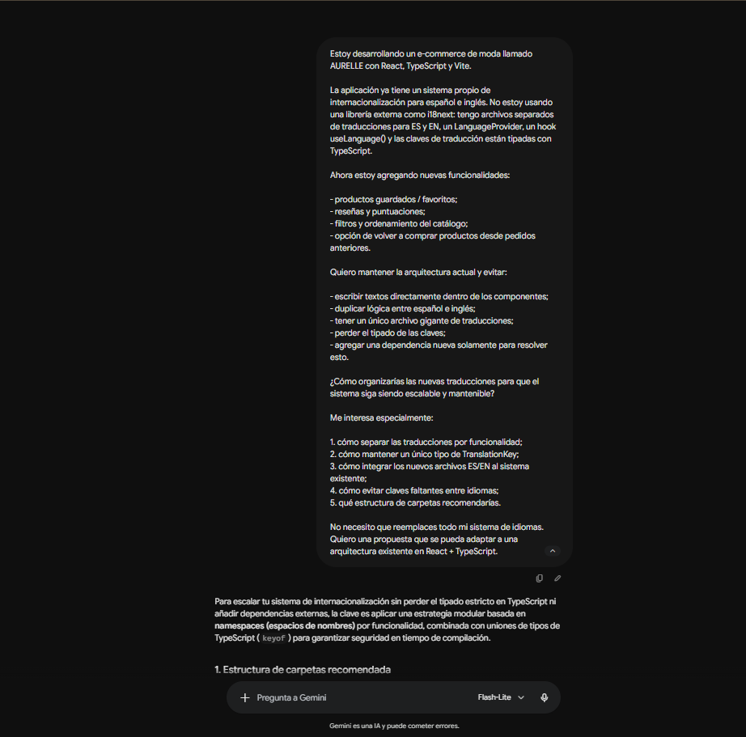
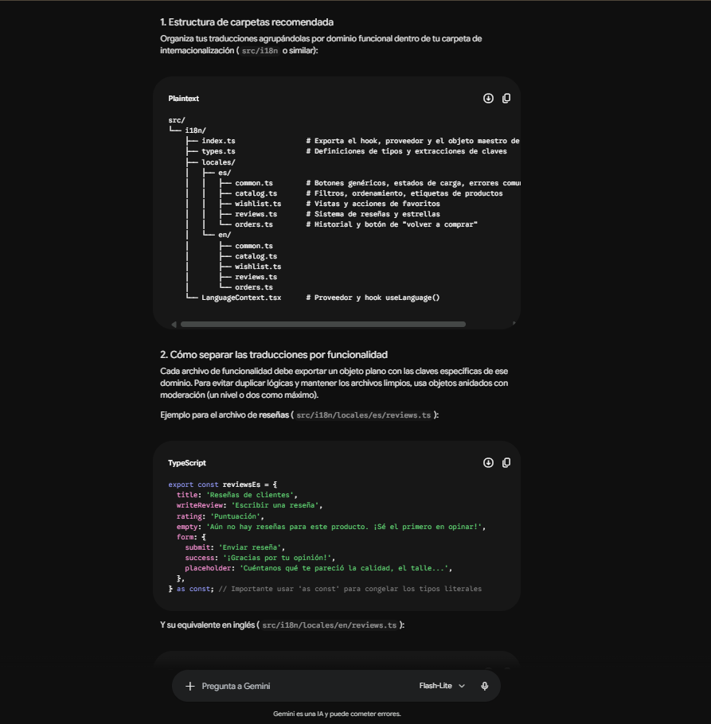
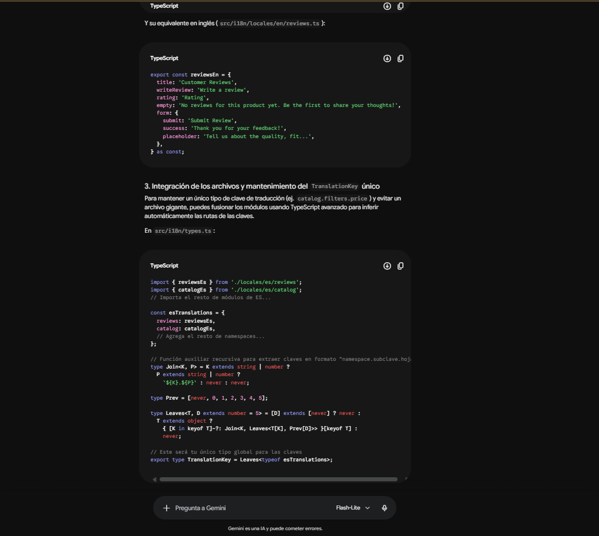
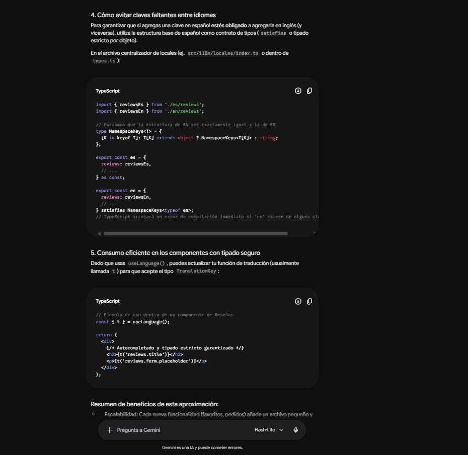
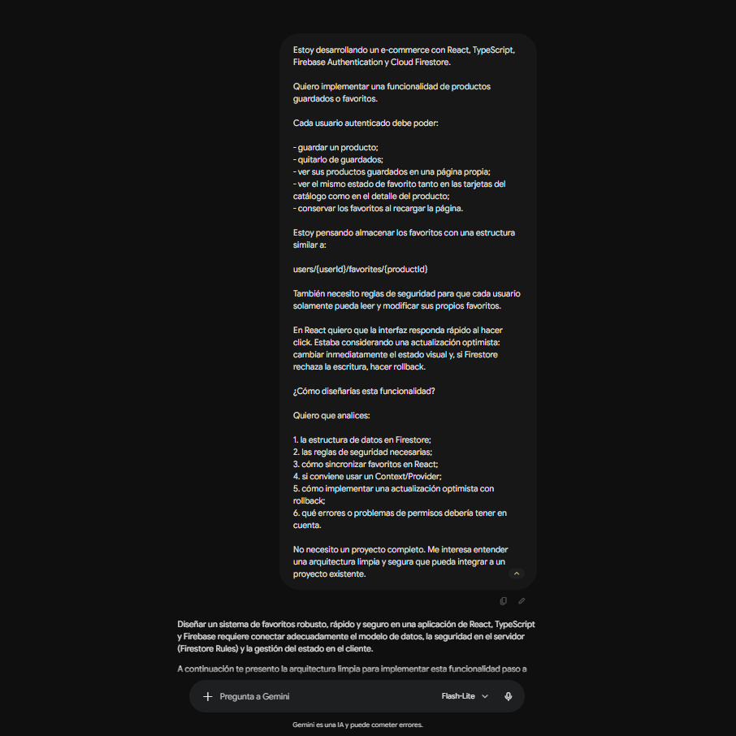
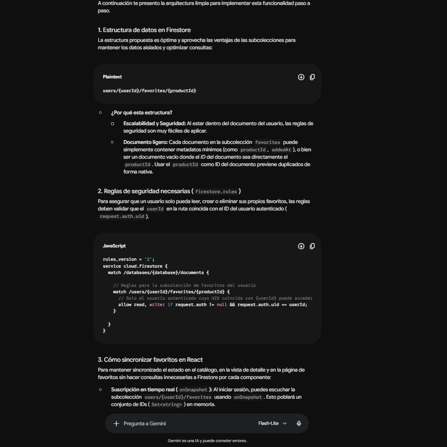
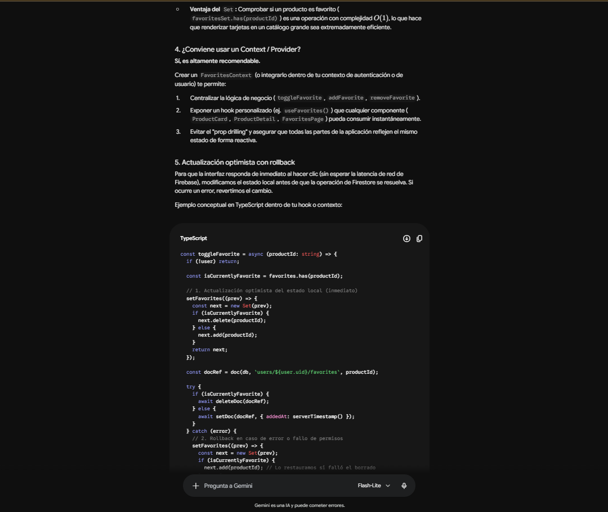
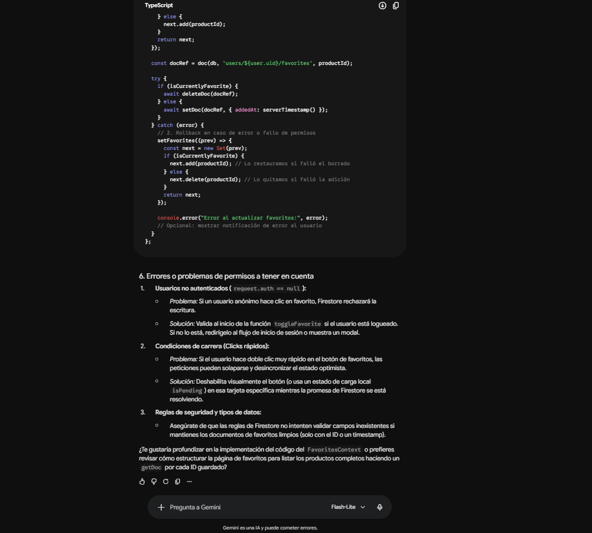

# Registro del uso de inteligencia artificial

La inteligencia artificial se utilizó como herramienta de orientación durante el desarrollo de **AURELLE**.

Las respuestas obtenidas fueron revisadas, comparadas con la estructura real del proyecto y adaptadas antes de ser implementadas. No todas las recomendaciones fueron utilizadas literalmente.

Para documentar este proceso se seleccionaron dos consultas realizadas con **Gemini**, relacionadas con funcionalidades que finalmente fueron incorporadas al proyecto.

[Volver al README principal](../README.md)

---

## 1. Organización de la internacionalización ES / EN

### Situación

AURELLE ya contaba con un sistema propio de internacionalización para español e inglés.

La aplicación utiliza:

- un `LanguageProvider`;
- un hook `useLanguage()`;
- archivos de traducción separados;
- claves de traducción tipadas mediante TypeScript.

Al incorporar nuevas funcionalidades como productos guardados, reseñas, filtros, ordenamiento y recompra de pedidos fue necesario ampliar el sistema sin:

- escribir textos directamente dentro de los componentes;
- duplicar lógica entre español e inglés;
- concentrar todas las traducciones en un único archivo demasiado grande;
- perder el tipado de las claves;
- agregar una dependencia externa únicamente para internacionalización.

El objetivo era mantener la arquitectura existente y encontrar una forma de escalar el sistema de traducciones sin reemplazarlo por completo.

### Prompt utilizado



### Respuesta de la IA

Gemini propuso organizar las traducciones utilizando módulos separados por funcionalidad o dominio.

También sugirió mantener una estructura equivalente entre español e inglés y utilizar TypeScript para conservar el tipado de las claves.



La respuesta también propuso generar un único tipo global para las claves mediante tipos recursivos de TypeScript.



Finalmente, Gemini propuso utilizar la estructura de un idioma como contrato para verificar que el otro contuviera las mismas claves y mantener el consumo tipado desde los componentes.



### Aplicación en el proyecto

La propuesta de dividir las traducciones por funcionalidad fue utilizada como referencia.

AURELLE mantiene sus traducciones dentro de:

```text
src/features/language/
```

Las funcionalidades incorporadas posteriormente fueron separadas en módulos específicos para cada idioma.

Por ejemplo:

```text
translations/
├── en/
│   ├── discovery.ts
│   ├── reorder.ts
│   └── reviews.ts
└── es/
    ├── discovery.ts
    ├── reorder.ts
    └── reviews.ts
```

También se mantuvieron tipos específicos relacionados con las nuevas áreas de traducción:

```text
translationDiscovery.types.ts
translationReorder.types.ts
translationReviews.types.ts
```

De esta forma las nuevas funcionalidades pudieron incorporarse sin concentrar todas las traducciones dentro de los archivos principales de español e inglés.

El sistema continuó utilizando el mismo `LanguageProvider` y el mismo hook `useLanguage()` que ya existían en el proyecto.

### Decisiones tomadas

La respuesta de Gemini fue utilizada como referencia, pero no se implementó literalmente.

#### Se mantuvo la arquitectura existente

Gemini propuso una estructura nueva basada en una carpeta general como:

```text
src/i18n/
```

AURELLE ya contaba con una funcionalidad de idioma organizada dentro de:

```text
src/features/language/
```

Por este motivo no se reorganizó todo el sistema.

La solución fue adaptada a la estructura existente.

#### No se agregó una librería externa

AURELLE ya resolvía correctamente el cambio de idioma mediante su propio provider y hook.

No fue necesario incorporar una dependencia adicional como `i18next`.

#### No se implementó el tipo recursivo propuesto

Gemini propuso generar automáticamente las claves mediante un tipo recursivo como:

```text
Leaves<T>
```

La aplicación ya contaba con un sistema de claves tipadas compatible con su arquitectura.

En lugar de reemplazar todo ese mecanismo, se decidió extender los tipos existentes por funcionalidad.

Esto permitió mantener el tipado sin introducir una capa adicional de complejidad.

#### Se mantuvo el selector de idioma existente

AURELLE ya utilizaba un selector personalizado para alternar entre:

```text
ES
EN
```

La ampliación del sistema de traducciones no modificó ese componente.

El selector continúa utilizando la misma lógica y apariencia que tenía antes de agregar las nuevas funcionalidades.

---

## 2. Productos guardados y persistencia en Firestore

### Situación

AURELLE necesitaba incorporar una funcionalidad de productos guardados o favoritos.

Cada usuario autenticado debía poder:

- guardar un producto;
- quitarlo de guardados;
- consultar sus productos guardados desde una página propia;
- ver el mismo estado de favorito en el catálogo y en el detalle del producto;
- conservar los favoritos después de recargar la aplicación.

También era necesario garantizar que cada usuario pudiera acceder únicamente a sus propios productos guardados.

Además, se buscaba que la interfaz respondiera inmediatamente al hacer click, sin esperar a que terminara la operación remota en Firestore.

### Prompt utilizado



### Respuesta de la IA

Gemini propuso almacenar los favoritos utilizando una subcolección dentro de cada usuario:

```text
users/{userId}/favorites/{productId}
```

También explicó cómo restringir el acceso mediante las reglas de seguridad de Firestore para que cada usuario pudiera trabajar únicamente con sus propios favoritos.



La respuesta continuó con la estrategia para sincronizar los favoritos desde React mediante una suscripción en tiempo real con `onSnapshot`.

También recomendó mantener los IDs dentro de un `Set<string>` para comprobar rápidamente si un producto se encuentra guardado.



Finalmente, Gemini desarrolló la utilización de un Context o Provider, la actualización optimista del estado y el rollback en caso de que Firestore rechazara una operación.



Entre las recomendaciones generales se encontraban:

- utilizar el `productId` como ID del documento;
- restringir el acceso mediante `request.auth.uid`;
- sincronizar los favoritos mediante `onSnapshot`;
- mantener los IDs dentro de un `Set<string>`;
- compartir el estado mediante un Context o Provider;
- aplicar una actualización optimista;
- realizar rollback si Firestore rechazaba la escritura.

### Aplicación en el proyecto

La estructura propuesta para Firestore fue utilizada en la implementación final:

```text
users/{userId}/favorites/{productId}
```

Cada documento mantiene información mínima relacionada con el producto guardado.

El estado de favoritos se comparte mediante:

```text
FavoritesProvider
FavoritesContext
useFavorites
```

La aplicación mantiene además un:

```text
Set<string>
```

con los IDs de los productos guardados.

Esto permite comprobar rápidamente si un producto se encuentra marcado como favorito.

El mismo estado se utiliza desde:

- las tarjetas del catálogo;
- el detalle del producto;
- la página de productos guardados.

### Sincronización con Firestore

Los favoritos se sincronizan mediante una suscripción a la subcolección correspondiente al usuario autenticado.

La responsabilidad de escuchar los cambios se mantiene separada de las operaciones que agregan o eliminan favoritos.

Entre las piezas utilizadas se encuentran:

```text
useFavoriteSubscription
subscribeFavorites
```

Esto permite que la interfaz se actualice cuando cambia la información almacenada en Firestore.

### Actualización optimista

La recomendación de utilizar una actualización optimista también fue aplicada.

Cuando el usuario guarda o elimina un producto, la interfaz refleja el cambio inmediatamente.

El flujo general es:

```text
Click del usuario
      ↓
Actualización del estado local
      ↓
Escritura en Firestore
      ↓
Éxito → mantener cambio
Error → rollback
```

La mutación y el rollback se manejan mediante lógica separada, principalmente desde:

```text
useFavoriteToggle
setFavorite
```

### Problema detectado durante las pruebas

Durante las primeras pruebas se observó que el botón cambiaba inicialmente al estado de guardado, pero poco después volvía al estado anterior.

Este comportamiento permitió comprobar que:

- la actualización optimista estaba funcionando;
- la escritura remota estaba fallando;
- el rollback también estaba funcionando correctamente.

El problema no provenía del estado de React.

Firestore estaba rechazando la escritura porque las reglas de seguridad publicadas todavía no contemplaban la nueva subcolección de favoritos.

Después de actualizar y publicar las reglas correspondientes, los favoritos comenzaron a persistir correctamente.

### Decisiones tomadas

La propuesta de Gemini fue adaptada a las convenciones y necesidades reales de AURELLE.

#### Se utilizó la estructura propuesta de Firestore

Gemini recomendó:

```text
users/{userId}/favorites/{productId}
```

Esta estructura coincidía con las necesidades del proyecto y fue utilizada en la implementación final.

El uso del `productId` como identificador del documento también evita duplicar un mismo producto dentro de los favoritos de un usuario.

#### Las reglas finales son más restrictivas

Gemini mostró como ejemplo una condición general basada en:

```text
request.auth != null
request.auth.uid == userId
```

AURELLE mantiene la validación de propiedad, pero las reglas finales también controlan la estructura permitida del documento.

Esto evita aceptar escrituras con campos inesperados.

#### Se adaptaron los campos del documento

Gemini mostró como ejemplo un campo como:

```text
addedAt
```

AURELLE utiliza:

```text
productId
createdAt
```

siguiendo las convenciones utilizadas en el resto del proyecto.

#### FavoritesProvider se mantuvo separado de AuthProvider

Gemini mencionó la posibilidad de integrar la lógica de favoritos dentro del contexto de autenticación.

En AURELLE se decidió mantener ambas responsabilidades separadas.

```text
AuthProvider
    ↓
identidad, sesión y perfil

FavoritesProvider
    ↓
productos guardados
```

De esta manera el sistema de autenticación no necesita administrar también el estado de favoritos.

#### La lógica fue dividida por responsabilidad

En lugar de concentrar toda la funcionalidad dentro de un único Context o hook, se separaron distintas responsabilidades.

Entre ellas:

```text
useFavoriteSubscription
useFavoriteToggle
useFavoritesState
useFavoriteProducts
setFavorite
subscribeFavorites
getFavoriteProducts
```

`useFavoriteSubscription` administra la sincronización.

`useFavoriteToggle` administra la mutación optimista y el rollback.

`useFavoritesState` reúne el estado utilizado por el provider.

Los servicios se encargan de las operaciones concretas con Firestore.

Esta separación permite mantener archivos más pequeños y responsabilidades más claras.

---

## Criterio general

La inteligencia artificial se utilizó como herramienta de consulta y apoyo para analizar posibles soluciones antes de implementarlas.

Las respuestas no fueron incorporadas automáticamente al proyecto.

En cada caso se evaluaron:

- la arquitectura existente;
- los requerimientos de AURELLE;
- el tipado;
- la seguridad;
- la complejidad de la propuesta;
- la facilidad de mantenimiento;
- la reutilización;
- la separación de responsabilidades;
- el comportamiento real de Firebase durante las pruebas.

Las recomendaciones compatibles con el proyecto fueron adaptadas.

Las propuestas que requerían reorganizaciones innecesarias o no coincidían con la arquitectura existente fueron modificadas o descartadas.

La implementación final y las verificaciones se realizaron sobre el código real de AURELLE.